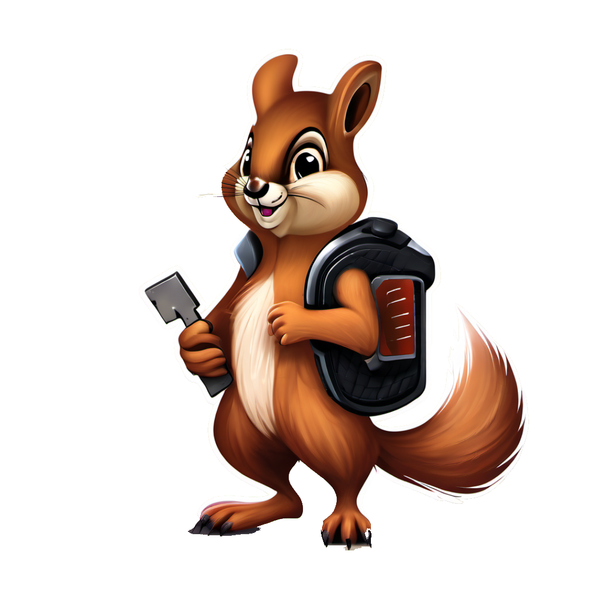
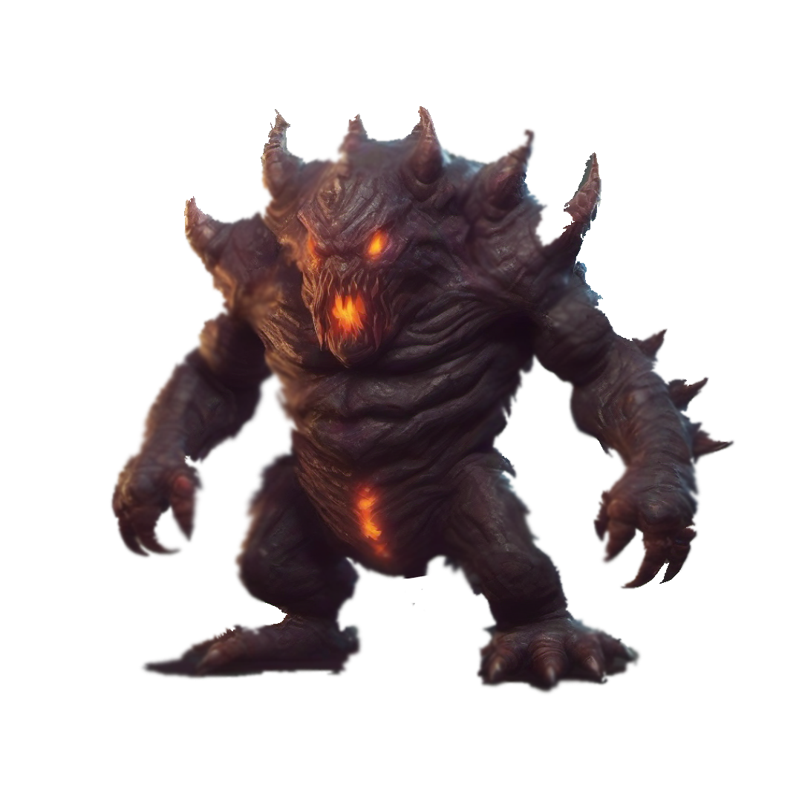
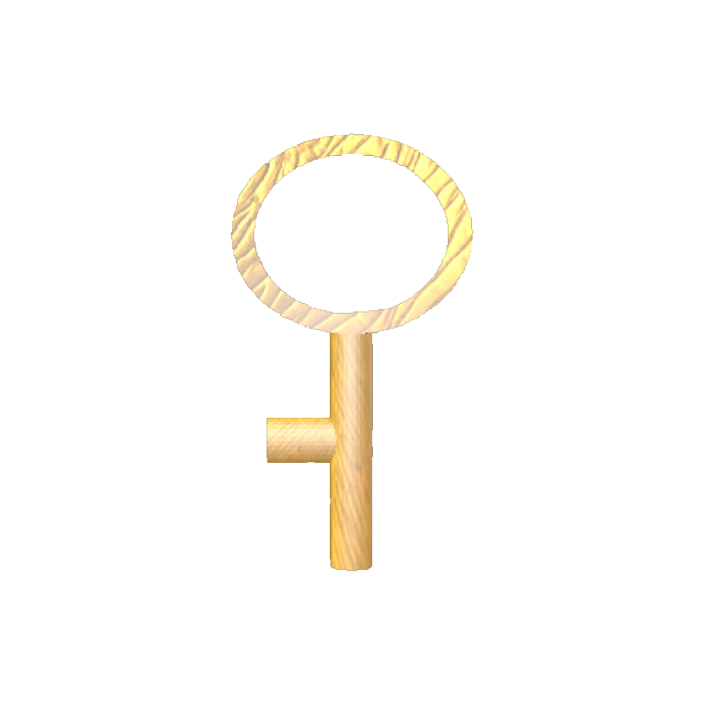
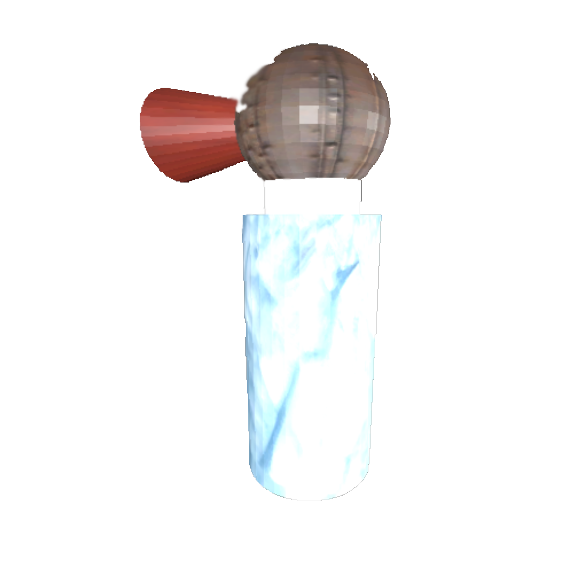
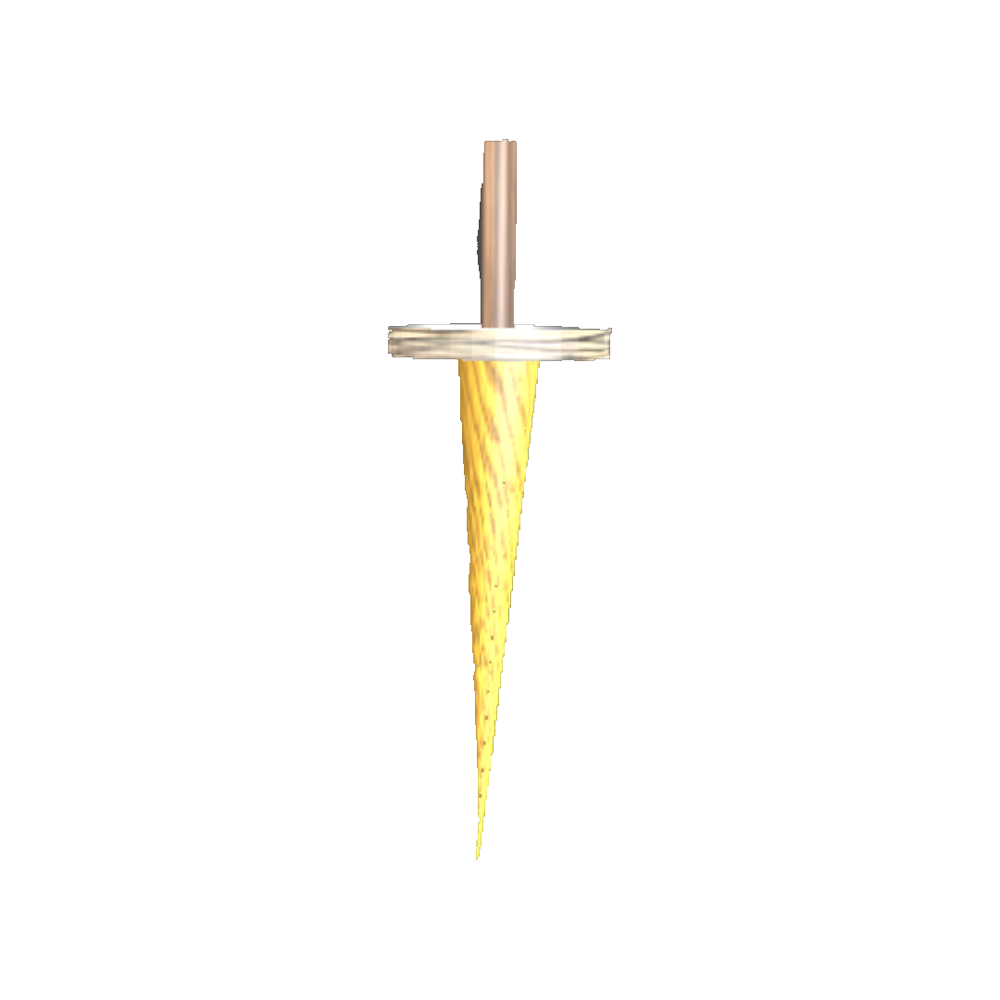
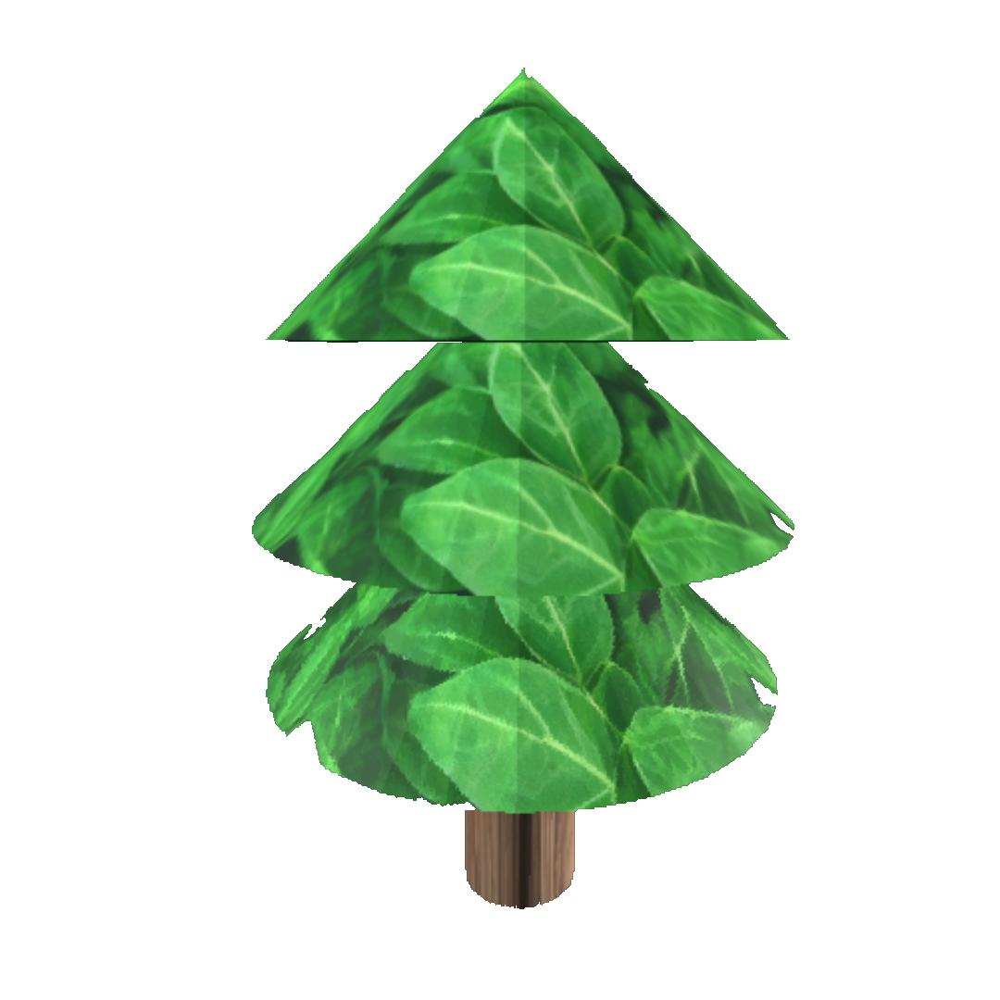
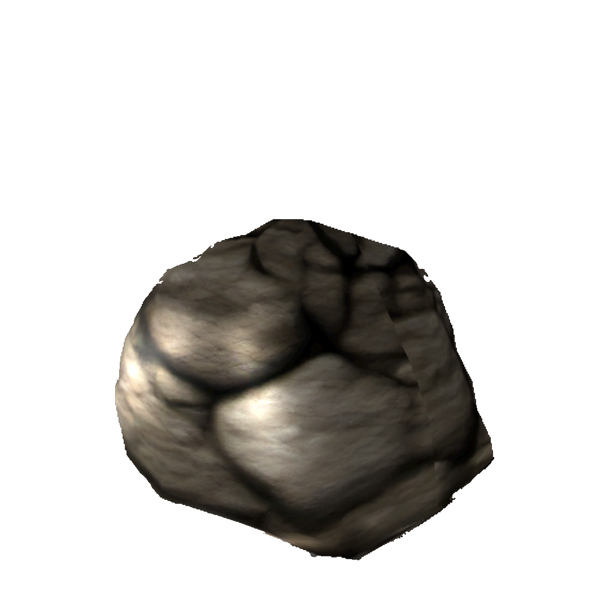

# escape_from_monster
This is a game to control a squarrel to escape from a area,
the squarrel must collect all 8 keys in the map to open the
gate to escape. You can also defeat the boss to get 3000
bonus scores if you want. Also, there are 2 type of tools
to overcome the enemies(walker, runner), they are 
freezer and swords

# appearance

| Name               | Screenshot                                  | Description                      |
|--------------------|---------------------------------------------|----------------------------------|
| squarrel           |         | main character.                  |
| walker             |     | 5 monsters                       |
| runner             |    | 1 monster                        |  
| key                |       | the key to open the gate         | 
| freezer            |   | tools to freeze the walker       | 
| sword              |     | tools to attack the runner       | 
| tree               |      | obstacles                        | 
| rock               |      | obstacles                        | 

# monster
1. **Walker (total 5)** 
	walker will be freezed as a ice cube for 15 seconds if you are 
	holding a freezer and touch him. Otherwise, you will lose a heart 

2. **Runner (1 only)**  
	runner will be 20% damaged if you are holding a sword and touch him.
	Otherwise, you will lose a heart 

# tools_usage
1. **Freezer**  
	there are total 3 freezer in the map, they can freeze walker
	(dont perform it to runner, otherwise you will lose a heart)
2. **Sword**  
	there are total 5 sword in the map, they can damage runner
	(dont perform it to walker, otherwise you will lose a heart)


# win_game_requirement
collect 8 keys and open the gate in 5 minutes

# failed_game_requirement
1. lose all 3 hearts
2. cannot finish the game in 5 minutes

# installation
see the release

# how to build the project (e.g. .apk, .exe)
1. clone the repository
```bash
   git clone https://github.com/JamesWong2600/escape_from_monster.git
```
2. import the folder "escape_from_monster" as the project in godot
3. open the project in code editor (e.g.vscode)
4. add a file must named "domain.txt" at the root path and paste your domain in the txt file
```bash
   git clone http://ip:port
```
5. click "Project" at the top-left corner
6. click "export"
7. select the type you want to export (e.g. apk, exe)
8. then the exported product will be in your "escape_from_monster" directory
